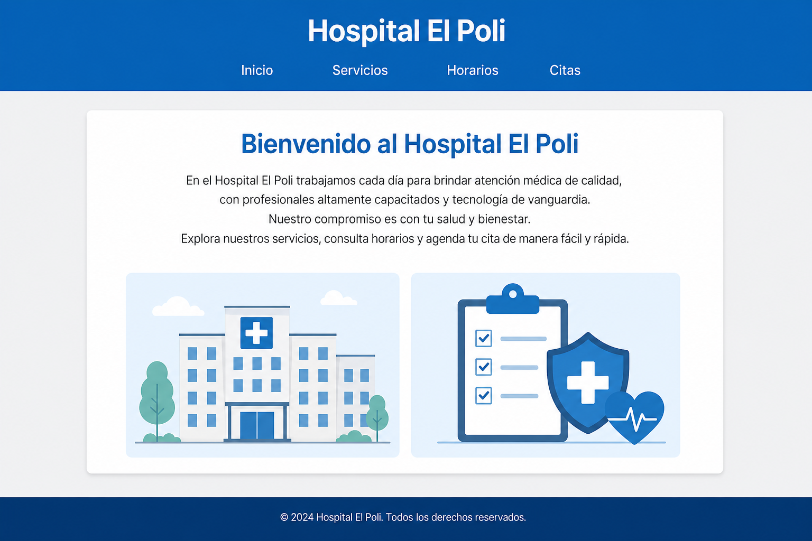
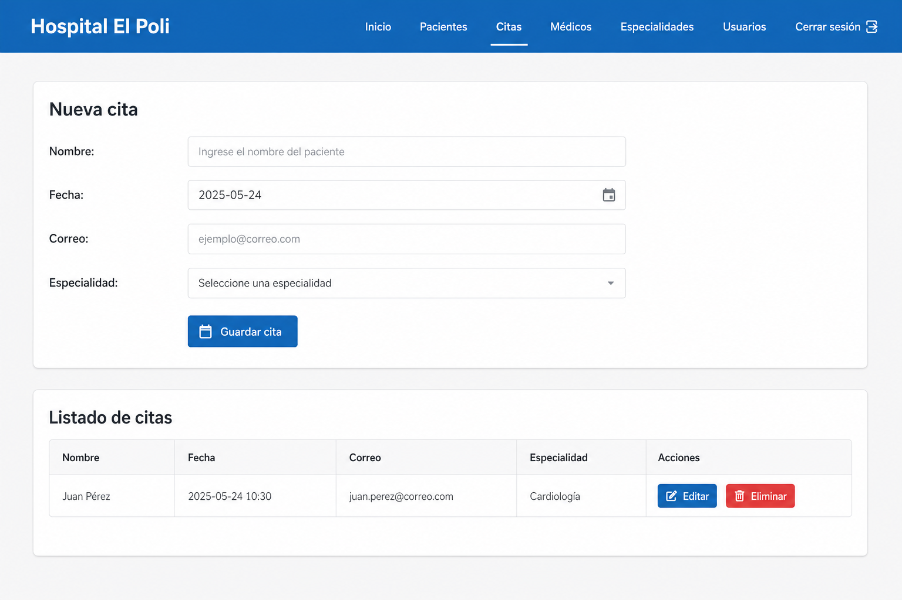

# Hospital El Poli — Aplicación en Angular

Proyecto académico de **front-end**: sitio institucional del Hospital El Poli desarrollado con **Angular 19**. Incluye página de inicio (bienvenida, servicios y horarios) y un **CRUD de citas** operando **solo en el cliente** (sin backend), con persistencia en `localStorage`.

**Repositorio:** [https://github.com/MelissaOcampoParra/Hospital_ElPoli](https://github.com/MelissaOcampoParra/Hospital_ElPoli)

---

## Vista de la aplicación

Capturas de la interfaz con el proyecto en ejecución en local (`npm start` / `ng serve`, [http://localhost:4200/](http://localhost:4200/)).

### Página de inicio



### Gestión de citas (CRUD)



---

## Autoría

| | |
|:---|:---|
| **Nombre** | Melissa Ocampo Parra |
| **Correo** | [c.melissa.ocampo.parra@gmail.com](mailto:c.melissa.ocampo.parra@gmail.com) |

---

## Requisitos previos

- [Node.js](https://nodejs.org/) (se recomienda la versión LTS; probado con Node 20+).
- [npm](https://www.npmjs.com/) (incluido con Node.js).

## Instalación y ejecución en local

Clonar el repositorio e instalar dependencias:

```bash
git clone https://github.com/MelissaOcampoParra/Hospital_ElPoli.git
cd Hospital_ElPoli
npm install
```

Levantar el servidor de desarrollo:

```bash
npm start
```

La aplicación queda disponible en [http://localhost:4200/](http://localhost:4200/).  
Equivalente: `npx ng serve`.

## Scripts principales

| Comando | Descripción |
|--------|-------------|
| `npm start` / `ng serve` | Servidor de desarrollo con recarga en caliente |
| `ng build` | Compilación de producción (salida: `dist/hospital-el-poli-angular`) |
| `ng test` | Ejecución de pruebas unitarias con Karma |

---

## Estructura del repositorio

```
Hospital_ElPoli/
├── docs/
│   └── screenshots/        # Capturas para el README
├── public/                 # Recursos estáticos (p. ej. favicon)
├── src/
│   ├── app/
│   │   ├── pages/
│   │   │   ├── home/       # Vista de inicio (secciones + gráficos SVG en plantilla)
│   │   │   └── citas/      # CRUD: tabla, formulario y validaciones
│   │   ├── models/         # Tipos TypeScript (p. ej. `Cita`)
│   │   ├── services/       # `CitaService` — localStorage y señales (`signals`)
│   │   ├── app.component.* # Cabecera, menú, pie de página
│   │   ├── app.routes.ts   # Rutas `/` y `/citas`
│   │   └── app.config.ts
│   ├── index.html
│   ├── main.ts
│   └── styles.css          # Estilos globales
├── angular.json
├── package.json
├── tsconfig*.json
├── .gitignore
└── README.md
```

---

## Funcionalidades implementadas

- **Navegación:** menú con inicio, enlaces por fragmento a servicios y horarios, y ruta `/citas`.
- **CRUD de citas:** crear, listar, editar y eliminar registros (nombre, fecha, correo, especialidad).
- **Almacenamiento local:** clave `hospital-el-poli-citas` en `localStorage` (datos propios del navegador).
- **Validación:** campos obligatorios; la fecha de la cita no puede ser anterior al día actual.

## Stack tecnológico

- Angular 19 (componentes **standalone**)
- TypeScript
- CSS

---

## Referencias

- [Documentación de Angular](https://angular.dev/)
- [Angular CLI](https://angular.dev/tools/cli)
